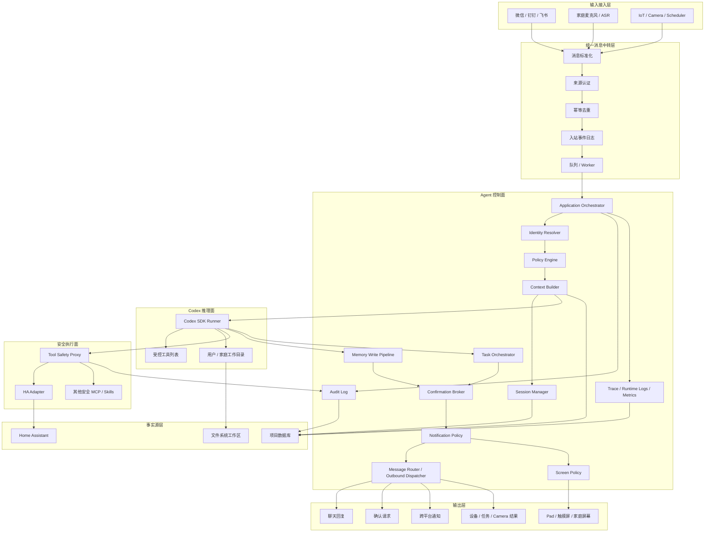

# Home Assist Agent 总体架构详细设计

本文档是 Home Assist Agent 的第一版总体架构详细设计，基于 README 中的架构结论整理而成。目标是把项目从“想法集合”收敛为可实现、可审计、可扩展的系统边界，并作为分层架构、架构不变量、核心契约、主请求链路、HA 事实源边界、Codex 控制边界、第一期边界和模块依赖规则的维护入口。

## 1. 项目定位

Home Assist Agent 是一个面向家庭场景的多用户生活助理中枢，不是单一聊天机器人，也不是 Home Assistant 的替代品。

它负责统一接入家庭成员、聊天平台、语音入口、IoT 事件、摄像头事件和定时任务，再通过 Agent 控制面组织身份、权限、上下文、任务、确认、审计和通知。复杂理解、计划和自然语言解释交给 Codex；真实设备状态和设备控制能力以 Home Assistant 为事实源；所有真实世界副作用必须经过本项目的安全代理。

核心定位可以概括为：

- 统一入口：微信、钉钉、飞书、语音、IoT、Camera、Scheduler 都先进入统一消息模型。
- 多用户助理：每个自然人有独立身份、权限、记忆、会话和 Codex 工作目录。
- 第一期本地可用：先以单家庭、单 owner、本地 PWA、真实 HA 低风险控制、提醒、记忆和解释型审计跑通日常自用。
- 展示增强：第一期同时提供 demo mode、决策卡片、trace replay 和 mock 高风险场景，用于客户展示。
- 家庭共享上下文：家庭规则、设备别名、共享习惯和公共任务独立于个人记忆。
- Codex 推理执行：Codex 负责理解意图、拆解任务、解释结果和调用受控工具。
- 外层控制边界：身份、权限、确认、审计、幂等、任务恢复、记忆写入和通知投递由本项目控制。
- HA 设备事实源：设备、实体、服务、区域和实时状态由 Home Assistant 维护，本项目不复制完整设备模型。

## 2. 分层架构

系统采用“输入接入层 + 统一消息中转层 + Agent 控制面 + Codex 推理面 + 安全执行面 + 事实源层 + 输出层”的分层结构。



### 2.1 输入接入层

输入接入层只做协议适配和必要的来源信息保留，不承载业务决策。

职责：

- 接收平台消息、语音转写、IoT 事件、Camera 事件和定时触发。
- 保留原始 payload、平台用户标识、会话标识、时间戳和来源元数据。
- 将输入交给统一消息中转层，不直接调用 Codex，不直接控制设备。

### 2.2 统一消息中转层

统一消息中转层是所有请求进入系统的入口闸门。

职责：

- 把不同来源转换为 `UnifiedMessage`。
- 校验 webhook、平台、设备或本地服务来源是否可信。
- 对平台重试、重复事件和重复触发做幂等去重。
- 先持久化入站事件，再进入 Agent 控制面。
- 对同一会话、同一用户、同一设备的事件提供必要的局部顺序保障。

### 2.3 Agent 控制面

Agent 控制面是本项目的核心业务边界。它不替代 Codex 推理，但握住所有现实世界控制权。

核心模块：

- `Application Orchestrator`：串联一条请求的身份、权限、上下文、Codex、工具、任务和输出流程。
- `Identity Resolver`：把平台账号、语音身份、群聊发言人解析为自然人 `Person` 或受限访客身份。
- `Policy Engine`：处理角色、权限、风险等级、来源信任、群聊语境、语音置信度和家庭规则。
- `Context Builder`：装配进入 Codex 的 `ContextBlock`，只读取允许使用的记忆、摘要和状态。
- `Session Manager`：管理 Codex 会话生命周期、48 小时压缩和会话摘要。
- `Memory Write Pipeline`：接收候选记忆，审核写入范围、可见性、过期时间和确认要求。
- `Task Orchestrator`：持久化、调度、恢复、取消和重试不能在单次响应内完成的任务。
- `Confirmation Broker`：统一处理高风险动作、身份合并、共享记忆和自动化建议的确认。
- `Notification Policy`：决定回复、私聊、群聊、语音播报、静默或升级通知。
- `Message Router / Outbound Dispatcher`：根据通知策略渲染并投递消息，保证低敏低风险内容优先原渠道回复，并处理失败重试和 fallback。
- `Screen Policy`：决定 Pad、触摸屏、墙面屏等可视化终端展示什么、隐藏什么、何时转手机确认。
- `Audit Log`：记录跨模块 append-only 审计事件，支持回放和排错。
- `Trace / Runtime Logs / Metrics`：记录 trace、工程日志和指标，支持按人、按模块、按 trace 排查。

### 2.4 Codex 推理面

Codex 推理面负责智能部分，但不拥有系统边界。

职责：

- 基于受控上下文理解用户意图。
- 生成自然语言回复、结构化动作、任务建议、确认请求和记忆候选。
- 调用本项目暴露的安全工具。
- 使用按 `home_id/person_id` 隔离的工作目录保存任务产物。

限制：

- 不直接判定用户身份。
- 不直接读取任意长期记忆。
- 不直接写入长期记忆。
- 不直接调用原始 HA 写能力。
- 不直接决定输出投递目标。

### 2.5 安全执行面

安全执行面是所有真实世界副作用的唯一出口。

职责：

- 接收 `ActionPlan` 或工具请求，生成 `ToolInvocation`。
- 展开 HA target，例如 area、device、domain 到具体实体。
- 查询 HA 当前状态和可用服务，校验动作是否可执行。
- 执行权限、风险、来源信任、幂等和确认检查。
- 对相对动作做规范化，例如“调暗一点”转换为明确亮度目标。
- 低风险动作可在策略允许时直接执行；高风险动作默认生成确认请求。
- 记录每次工具请求、策略决策、HA 调用和结果。

### 2.6 事实源层

事实源层包含 Home Assistant、项目数据库和文件系统工作区。

- Home Assistant：设备、实体、区域、服务和实时状态的事实源。
- 项目数据库：用户、身份、权限、任务、确认、记忆、消息、工具调用和审计的事实源。
- 文件系统工作区：Codex 用户工作目录、家庭工作目录和任务产物的存储位置。

### 2.7 输出层

输出层不只是把 Codex 文本原样发送出去，而是根据通知策略投递结构化结果。

输出类型：

- 普通聊天回复。
- 私聊或群聊确认请求。
- IoT 控制结果或拒绝原因。
- 自动化建议和定时任务建议。
- Camera 事件或历史检索结果。
- 跨平台通知、静默记录或升级告警。
- Pad、触摸屏和家庭屏幕上的可视化卡片、提醒、确认交接和低敏状态。

### 2.8 本轮新增模块收敛

本轮针对消息、日志和可视化三个方向补充了更细的模块边界：

- 消息模块拆成 `Notification Policy` 和 `Message Router / Outbound Dispatcher`。前者决定发给谁、是否原渠道、是否私聊或静默；后者只负责投递工程问题，例如渲染、重试、fallback 和 `DeliveryAttempt`。
- 日志模块拆成 `EventLog`、`AuditEvent`、`TraceSpan`、`RuntimeLog` 和 `MetricsRollup`。审计是不可丢的事实链，trace 和 runtime log 服务于排障和性能分析。
- 可视化模块把 Pad、墙面屏、入口屏建模为 `DisplaySurface`。屏幕不是用户身份，屏幕上的点击也必须重新进入统一消息链路和安全策略。

详细设计分别见 [消息路由与原渠道响应](message-routing.md)、[日志、审计与可观测性](logging-observability.md)、[可视化触摸屏与家庭屏幕](visual-surfaces.md)。

## 3. 架构不变量

以下规则是系统长期演进时不能破坏的硬边界。

1. 任何有副作用的真实世界调用不得绕过 `Tool Safety Proxy`。
2. Home Assistant 是设备能力、实体、服务、区域和实时状态的事实源。
3. 本项目第一期不维护独立 `Capability Registry`，不复制完整 `Home State`。
4. Codex 可以提出动作、任务、记忆候选和确认请求，但不能拥有最终执行权。
5. Codex 不直接写长期记忆，只能提交 `MemoryCandidate`。
6. 身份不确定时只能低风险回复或澄清，不能读取私人记忆或执行敏感控制。
7. 群聊中必须区分 conversation、speaker、mentioned user 和 target user。
8. 不可信内容不能在摘要、记忆或上下文装配中被升级为可信指令。
9. 确认是可持久化任务，必须可恢复、可过期、可撤销、可审计。
10. 确认通过不等于直接执行，通过后仍需重新进入 `Tool Safety Proxy` 检查当前状态和权限。
11. 输出目标由 `Notification Policy` 决定，Codex 不直接决定发给谁或发到哪里。
12. `Audit Log` 是跨切面的 append-only ledger，覆盖输入、身份、上下文、Codex、工具、确认、HA 和输出。
13. 所有核心模型都必须携带 `home_id` 或可追溯到 `home_id`。
14. 家庭共享记忆不能自动覆盖个人偏好，个人隐私偏好不能自动扩散给全家。
15. 服务降级时，高风险动作默认拒绝或转确认，不允许在缺少审计、策略或 HA 状态时强行执行。

## 4. 核心数据契约列表

第一期实现前建议先冻结以下契约。字段可以逐步扩展，但语义边界应保持稳定。

| 契约 | 归属模块 | 用途 | 关键约束 |
| --- | --- | --- | --- |
| `UnifiedMessage` | Relay | 所有输入事件的统一模型 | 必须包含 `trace_id`、来源、内容类型、actor、provenance、`trust_level` |
| `ActorContext` | Identity | 身份解析结果 | 包含 `home_id`、`person_id`、角色、置信度、来源和权限摘要 |
| `Person` | Identity | 家庭成员自然人 | 不等同于平台账号；可绑定多个外部身份 |
| `HomeMembership` | Identity / Policy | 人与家庭的成员关系 | 包含角色、状态、权限模板和有效期 |
| `ExternalIdentity` | Identity | 微信、飞书、钉钉等平台身份 | 不能仅凭昵称自动合并 |
| `IdentityLink` | Identity | 外部身份或音色身份到 `Person` 的绑定 | 需要状态机、审计和撤销能力 |
| `PermissionGrant` | Policy | 细粒度授权 | 按家庭、设备、区域、动作、风险、来源、时间段约束 |
| `ContextBlock` | Context | 进入 Codex 的唯一上下文单元 | 必须标记来源、信任级别和允许用途 |
| `ContextAssemblyRecord` | Context / Audit | 记录本次上下文装配 | 记录包含和排除的记忆、摘要、状态和 token 预算 |
| `SessionSummary` | Session | Codex 会话压缩摘要 | 不是长期记忆；沉淀前必须转为候选记忆 |
| `CodexResult` | Codex Runner | Codex 的结构化输出 | 包含回复、动作意图、任务建议、候选记忆、确认请求和观察 |
| `ActionPlan` | Codex / Task / Policy | 结构化动作意图 | 不代表已授权执行，必须再过策略和代理 |
| `ToolPolicy` | Policy / Tool Proxy | 工具与实体安全策略 | 定义风险、角色、确认、来源限制和直接执行条件 |
| `ToolInvocation` | Tool Proxy / Audit | 工具调用记录 | 记录策略决策、状态、`operation_id` 和幂等 key |
| `Task` | Task Orchestrator | 可恢复任务 | 支持状态、触发器、过期、lease、取消和审计 |
| `TaskRun` | Task Orchestrator | 每次任务执行 attempt | 支持重试、幂等、错误记录和部分失败分析 |
| `ConfirmationRequest` | Confirmation Broker | 统一确认请求 | 支持批准、拒绝、撤销、过期、替代和多方确认 |
| `MemoryCandidate` | Memory Pipeline | 候选记忆 | 包含来源、证据、断言强度、可见性、确认要求和过期时间 |
| `MemoryEntry` | Memory Pipeline | 已批准记忆 | 只读取 approved 且未过期的可见记忆 |
| `MemoryCorrection` | Memory Pipeline | 记忆纠正或遗忘记录 | 不物理破坏审计链 |
| `AuditEvent` | Audit | 跨模块审计事件 | append-only，关联 `trace_id`、模块、动作、结果和敏感引用 |
| `RequestTrace` | Observability | 一次请求或事件的摘要索引 | 支持按 trace、person、module、error 快速排查 |
| `TraceSpan` | Observability | 跨模块调用树 | 兼容 OpenTelemetry 风格字段，记录耗时、错误和 token |
| `RuntimeLog` | Observability | 工程调试日志 | 短期保留、强脱敏，不作为审计事实源 |
| `OutputEnvelope` | Notification Policy | 最终投递载体 | 包含目标、类型、确认要求、审计引用和敏感等级 |
| `RouteRef` | Message Routing | 入站消息的可回复路由 | 保存平台、会话、thread、reply_to、能力和过期时间 |
| `ReplyTarget` | Message Routing | 出站投递目标 | 区分原渠道、私聊、群聊、语音、屏幕、静默 |
| `MessageEnvelope` | Message Routing | 可投递消息 | 经过通知策略后才能进入出站调度器 |
| `DeliveryAttempt` | Message Routing | 每次投递尝试 | 记录重试、fallback、平台消息 ID 和错误 |
| `DisplaySurface` | Visual Surfaces | Pad、墙面屏、入口屏等终端 | 屏幕是 surface，不等于用户身份 |
| `ScreenSession` | Visual Surfaces | 屏幕交互会话 | 记录认证方式、活跃身份、隐私模式和过期 |
| `UIEvent` | Visual Surfaces / Relay | 触摸、表单、语音等屏幕输入 | 重新进入统一消息链路，不直接调用设备 |
| `VisualDecision` | Visual Surfaces | 屏幕展示策略结果 | 决定显示、脱敏、转手机、确认、静默或升级 |

## 5. 主请求链路

主链路固定为：

```text
Adapters
  -> Relay / Event Log
  -> Application Orchestrator
  -> Identity / Policy / Context
  -> Codex SDK Runner
  -> Tool Safety Proxy
  -> HA Adapter
  -> Home Assistant MCP
  -> Notification Policy
  -> Message Router / Screen Policy
  -> Channel Adapter / Display Gateway
```

### 5.1 普通文本控制低风险设备

1. 用户从微信、飞书、钉钉或 HTTP mock adapter 发来“把客厅灯调暗一点”。
2. 输入适配器生成原始事件，Relay 转成 `UnifiedMessage`。
3. Relay 做来源认证、幂等去重、入站持久化，并投递给 Orchestrator。
4. `Identity Resolver` 解析平台身份，生成 `ActorContext`。
5. `Policy Engine` 判断该用户是否可在当前来源发起低风险控制。
6. `Context Builder` 读取必要的个人偏好、家庭共享规则、会话摘要和 HA 状态查询结果，生成 `ContextBlock`。
7. `Codex SDK Runner` 调用 Codex，得到 `CodexResult`，其中包含调暗客厅灯的 `ActionPlan`。
8. `Tool Safety Proxy` 接收动作，查询 HA 展开客厅灯实体，读取当前亮度，规范化目标亮度。
9. `Tool Safety Proxy` 套用 `ToolPolicy`、权限、来源信任、风险等级和幂等规则。
10. 如果允许直接执行，`HA Adapter` 调用 Home Assistant MCP。
11. 结果写入 `ToolInvocation` 和 `AuditEvent`。
12. `Notification Policy` 决定原路回复用户，例如返回“已调暗客厅灯”。
13. `Message Router` 使用入站 `RouteRef` 生成 `MessageEnvelope` 并通过对应渠道投递；如果来源是屏幕，则交给 `Screen Policy` 和 `Display Gateway` 渲染低敏结果。

### 5.2 高风险或身份不确定请求

1. 家庭麦克风收到“把门打开”。
2. ASR 生成文本，音色识别置信度不足。
3. `UnifiedMessage.trust_level` 被标记为 `weak_user_instruction`。
4. `Identity Resolver` 无法确定高置信度 `Person`。
5. `Policy Engine` 识别目标涉及门锁等高风险实体。
6. 系统不得执行动作，也不得读取私人记忆。
7. `Confirmation Broker` 或 `Notification Policy` 生成澄清或手机确认请求。
8. 审计记录保留原始来源、身份置信度、拒绝原因和通知目标。

### 5.3 需要确认的任务

1. Codex 或策略层生成需要确认的 `ActionPlan`，例如创建自动化、共享记忆或执行高风险控制。
2. `Confirmation Broker` 创建 `ConfirmationRequest`。
3. `Task Orchestrator` 将确认作为 `Task` 持久化，设置过期时间和触发条件。
4. `Notification Policy` 将确认请求投递到原平台、私聊或管理员渠道。
5. 用户批准后，任务重新进入执行流程。
6. 执行前重新查询当前 HA 状态、复核权限、确认 preconditions 和动作 hash。
7. 若状态漂移或权限失效，确认作废或要求重新确认。

### 5.4 记忆写入链路

1. Codex 在 `CodexResult` 中提交 `MemoryCandidate`。
2. `Memory Write Pipeline` 根据来源、断言强度、范围、可见性、类型和置信度判断处理方式。
3. 个人私有、低风险、明确表达的偏好可进入候选后自动批准或轻量审核。
4. 家庭共享规则、权限相关记忆、跨用户可见信息必须走确认。
5. 通过审核后生成 `MemoryEntry`，并记录审计。
6. 用户纠正时生成 `MemoryCorrection` 或新版本，不直接破坏审计链。

## 6. HA 事实源边界

Home Assistant 是家庭设备世界的事实源。本项目通过 Home Assistant MCP 和 `HAAdapter` 使用 HA 能力，不在项目数据库中维护另一套完整设备模型。

本项目可以做：

- 查询 HA 实体、区域、设备、服务和实时状态。
- 调用 HA 服务执行设备控制。
- 对 HA target 做展开和规范化。
- 维护本项目自己的安全元数据，例如高风险实体清单、用户授权、确认要求和来源限制。
- 在审计中记录 HA 查询、控制请求、返回结果和状态确认结果。

本项目第一期不做：

- 不复制 HA 的完整实体模型。
- 不维护独立 `Capability Registry`。
- 不维护完整 `Home State` 快照作为决策事实源。
- 不让 Codex 根据自然语言猜测设备能力。
- 不把 HA 设备名、区域名、自动化名当成可信指令。

缓存策略：

- 第一期默认实时查询 HA。
- 后续如果性能、稳定性或上下文成本成为瓶颈，可以增加轻量缓存。
- 缓存只能作为加速层，不能成为设备事实源。
- 执行前必须以 HA 当前状态和 `Tool Safety Proxy` 检查结果为准。

HA 调用结果需要区分：

- `accepted`：HA 接受了服务调用，但不一定确认状态变化。
- `confirmed_changed`：已确认状态变化。
- `no_op`：目标已经处于期望状态。
- `failed`：明确失败。
- `unknown`：调用或状态确认结果不确定，需要通知或重试。

## 7. Codex 控制边界

Codex 是推理器和受控工具调用者，不是系统控制面。

Codex 可以：

- 理解用户自然语言、事件和上下文。
- 生成回复、解释、任务计划和动作意图。
- 调用本项目暴露的安全只读工具或安全写工具。
- 提交 `ActionPlan`、`Task` 建议、`MemoryCandidate` 和 `ConfirmationRequest`。
- 在隔离工作目录中处理任务文件和中间产物。

Codex 不能：

- 决定当前用户是谁。
- 绕过 `Policy Engine` 和 `Tool Safety Proxy`。
- 直接调用原始 HA 写工具。
- 直接写入 `MemoryEntry`。
- 直接创建长期自动化或高风险控制。
- 直接决定消息投递对象。
- 把摄像头 OCR、网页、设备名、群聊引用、ASR 低置信度文本当成系统指令。

上下文装配规则：

- 进入 Codex 的内容必须包装为 `ContextBlock`。
- 每个 `ContextBlock` 必须携带来源、信任级别和允许用途。
- `trusted_context` 可作为决策依据，但仍受权限约束。
- `user_instruction` 可表达当前用户意图，但不能跳过安全策略。
- `weak_user_instruction` 只能走澄清、低风险或建议。
- `untrusted_content` 只能作为被分析数据，不能作为指令执行。
- `SessionSummary`、`MemoryCandidate` 和 `ContextAssemblyRecord` 必须保留来源和信任级别，避免摘要污染。

## 8. 第一期（本地可用版）边界

第一期目标不是最小技术闭环，而是做出用户本人可以在本地长期自用的软件版本，同时内置客户展示所需的 showcase 能力。范围入口见 [phase-1-local-usable.md](phase-1-local-usable.md)。

### 8.1 第一期包含

- 单进程 Python 服务或等价本地服务，支持本地配置、启动、重启恢复和健康检查。
- 本地 PWA 或 local web UI，作为第一期主要入口，承载聊天、家庭概览、设备卡片、任务、确认、记忆和 trace replay。
- SQLite 存储用户、身份、消息、任务、任务执行、确认、记忆候选、正式记忆、工具调用、通知决策和审计。
- 单家庭、单 owner 的 `single_user_mode`，保留 `home_id/person_id/trust_level` 字段和长期多用户扩展边界。
- 按 `home_id/person_id` 隔离的 Codex 文件系统工作目录。
- `UnifiedMessage`、`ActorContext`、`ContextBlock`、`ActionPlan`、`ToolInvocation`、`Task`、`TaskRun`、`ConfirmationRequest`、`MemoryCandidate`、`AuditEvent` 等核心契约。
- 真实 Home Assistant 只读查询和低风险 allowlist 控制。
- `HAAdapter` 和 `Tool Safety Proxy`，支持 HA 状态查询、target 展开、相对动作规范化、幂等、高风险阻断和审计。
- 真实 Codex SDK 路径；mock Codex 仅用于测试、降级或 showcase。
- `Memory Write Pipeline`，支持个人私有低风险偏好、候选记忆、正式记忆、纠正记录和上下文装配记录。
- `Task Orchestrator`，支持一次性提醒、简单事件提醒、确认等待和单进程 worker 恢复。
- 简化 `Confirmation Broker`，支持本地确认页、过期、拒绝、撤销、action hash 绑定和审计。
- 简化 `Notification Policy`，支持本地 PWA 输出、owner 私有输出、静默和敏感内容不外泄。
- 解释型审计和本地 trace replay。
- showcase/demo mode，支持 demo seed data、决策卡片、mock 门锁/camera/OCR 注入和演示重置。

### 8.2 第一期不包含

- 微信、钉钉、飞书等多平台完整接入。
- 多家庭、多租户和完整跨平台身份合并。
- 独立 `Capability Registry`。
- 完整 `Home State` 快照。
- 真实摄像头历史视频检索。
- 完整音色识别模型训练和反重放。
- 复杂自动化编排 UI。
- 高风险设备真实写控制。
- 复杂向量记忆系统。
- 多 worker 分布式调度。
- 合规级观测平台、外部 OTel/Langfuse 导出和日志权限矩阵。

### 8.3 第一期建议落地顺序

1. 建立本地服务、配置文件、SQLite、健康检查和本地 PWA 骨架。
2. 建立 `single_user_mode`：默认 `home_id`、owner `person_id`、本地 token 和基础 `ActorContext`。
3. 接入真实 HA 只读查询，完成实体/区域读取和健康显示。
4. 接入 `Tool Safety Proxy` 和 `HAAdapter`，实现灯光 allowlist、相对动作规范化、幂等和审计。
5. 接入真实 Codex SDK，限定只暴露受控工具；保留 mock Codex 用于测试和 demo。
6. 做本地 PWA 的聊天、设备卡片、执行结果和 trace replay。
7. 做一次性提醒和简单事件提醒。
8. 做个人低风险偏好记忆和记忆管理。
9. 做本地确认页和高风险 `blocked/dry_run/not_supported_in_phase_1` 链路。
10. 做 showcase/demo mode：seed data、mock 门锁/camera/OCR 注入、决策卡片和重置能力。
11. 补 E2E 回归：低风险开灯、高风险阻断、身份不确定、prompt injection、记忆候选、任务恢复、HA/Codex/审计降级。

## 9. 模块依赖规则

模块依赖应保持单向和显式，避免业务逻辑散落到适配器、Codex 工具或 HA 调用里。

### 9.1 允许的主依赖方向

```text
adapters
  -> relay
  -> orchestrator
  -> identity / policy / context / sessions
  -> codex_runner
  -> tools / tasks / confirmations / memory
  -> ha
  -> notifications
  -> message_routing / visual_surfaces
  -> audit / observability / storage
```

### 9.2 长期依赖规则

- `adapters` 只能做协议适配，不依赖 `codex_runner`、`ha` 或具体业务策略。
- `relay` 负责标准化、认证、幂等和持久化，不执行设备控制。
- `orchestrator` 可以编排其他模块，但不直接写 HA、不直接写长期记忆。
- `identity` 不依赖 Codex 推断用户身份；Codex 可辅助解释，但不能成为身份事实源。
- `policy` 可以读取身份、权限、家庭规则和工具策略，不依赖具体平台 SDK。
- `context` 只读取 approved memory、session summary 和按需查询结果，不写长期记忆。
- `sessions` 负责会话生命周期和压缩摘要；摘要不是长期记忆。
- `codex_runner` 是 SDK 适配器，不拥有身份、权限、存储和 HA 细节。
- `memory` 只处理候选、审核、确认、正式记忆和纠正，不从 Codex 直接信任长期事实。
- `tasks` 不直接绕过策略和工具代理；任务触发时重新进入同一执行链路。
- `confirmations` 不执行真实动作，只创建、投递、审批、拒绝、过期和唤醒后续流程。
- `tools` 中所有写操作必须经过 `Tool Safety Proxy`，并生成 `ToolInvocation`。
- `ha` 只封装 HA MCP 调用和状态确认，不保存完整 HA 设备模型。
- `notifications` 根据策略决定输出目标，不让 Codex 直接选目标。
- `message_routing` 根据通知决策渲染、发送、重试和 fallback，不重新做权限判断。
- `visual_surfaces` 只处理屏幕展示和 UI 事件归一化，所有屏幕动作都重新进入 Relay 和 Tool Safety Proxy。
- `audit` 被各模块调用，但不反向驱动业务逻辑。
- `observability` 记录 trace、运行日志和指标，不承载业务判断。
- `storage` 提供持久化能力，不承载跨模块业务判断。

### 9.3 禁止依赖和反模式

- 禁止 `Codex -> Home Assistant MCP -> Home Assistant` 的直接写链路。
- 禁止平台 adapter 直接执行设备动作。
- 禁止把 HA 实体表复制成本项目的事实源。
- 禁止仅凭昵称、群名或低置信度音色自动合并身份。
- 禁止把群聊发言人、群聊本身和目标用户混为一谈。
- 禁止任务 worker 直接执行高风险动作。
- 禁止确认通过后跳过状态复核。
- 禁止把未经确认的家庭共享规则直接写成长期记忆。
- 禁止把不可信内容拼入普通系统提示，导致 prompt injection。

## 10. 关键工程切分

建议工程目录与架构边界保持一致：

```text
src/home_assist_agent/
  adapters/
  relay/
  orchestrator/
  identity/
  policy/
  context/
  sessions/
  codex_runner/
  tools/
  ha/
  memory/
  tasks/
  confirmations/
  notifications/
  message_routing/
  visual_surfaces/
  audit/
  observability/
  storage/
  config/
```

每个目录应优先暴露清晰的 service/interface，而不是让调用方穿透内部表结构或第三方 SDK。跨模块通信优先使用核心数据契约，减少隐式字典和自由文本协议。

## 11. 风险优先级

实现过程中应优先守住这些风险：

1. 真实世界副作用风险：所有写操作经过 `Tool Safety Proxy`、幂等、确认和审计。
2. 身份误判风险：身份不确定时降级，敏感动作必须确认。
3. Prompt injection 风险：所有非系统内容保留 provenance 和 trust level。
4. 记忆污染风险：Codex 只能提交候选，长期记忆需要治理。
5. 任务恢复风险：确认、定时和会话维护必须可恢复、可取消、可过期。
6. HA 状态漂移风险：确认后执行前重新查询 HA 和 preconditions。
7. 通知泄露风险：敏感内容默认私聊或静默，不在群聊中扩散。
