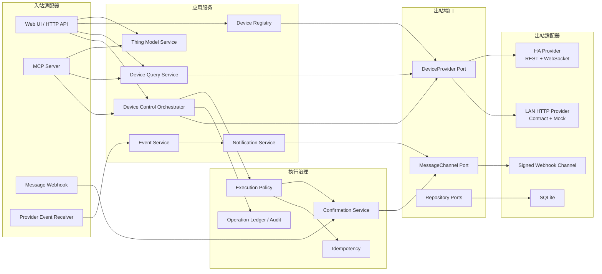
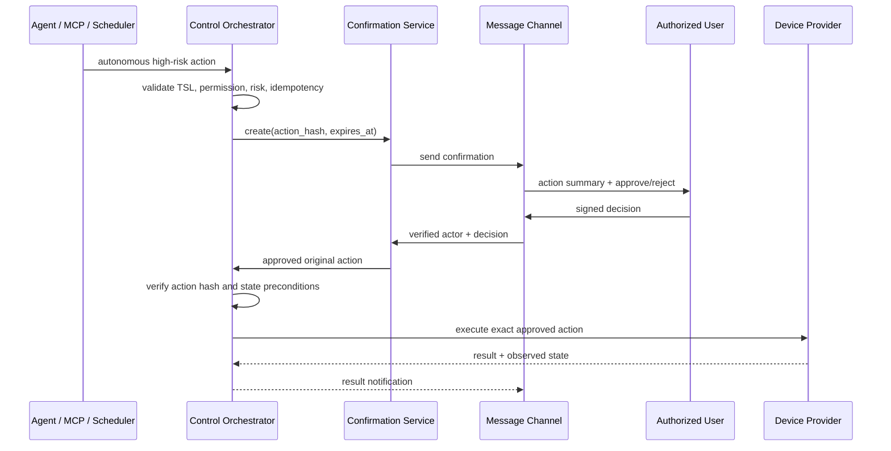

# 独立 IoT MCP 子模块设计

文档状态：设计已确认，代码未创建。

## 1. 目标与当前边界

### 1.1 目标

在主项目内新增独立子模块 `modules/iot-mcp/`，统一管理和控制以下设备：

| 设备来源 | 当前能力 |
| --- | --- |
| Home Assistant | 通过 REST API 和 WebSocket API 同步设备、实体、状态、服务和事件，并执行真实控制 |
| 局域网非 HA 设备 | 保留 HTTP Provider 契约和 Mock Provider，不绑定具体厂商协议 |

子模块使用阿里云 IoT TSL 规范描述产品能力，以属性、服务、事件为统一抽象，对外提供 MCP、HTTP API 和管理页面，并支持消息通道上的自动高危操作确认。

### 1.2 与主项目的关系

当前方案保持子模块独立启动、独立存储、独立管理页面，不修改主项目已有调用链。

主项目现有文档仍以 Home Assistant 为设备事实源，并且不维护独立 `Capability Registry`。本子模块引入的 TSL 物模型属于“设备能力定义与 Provider 映射”，不保存能够替代 Provider 的实时状态：

- HA 设备状态和可用能力仍以 HA 实时查询为准。
- 局域网设备状态仍以对应 Provider 实时查询为准。
- 本地属性快照只服务于展示、事件分发和故障诊断，必须携带 `observed_at` 和 freshness。
- 未来接入主项目时，主项目只能通过 HTTP、MCP 或应用门面访问本子模块，不能穿透数据库。

因此，物模型注册表与设备状态事实源职责保持分离。

主项目现有第一期方案禁止高风险设备真实写，本子模块则允许已认证用户在独立设备页面直接操作高风险设备。由于子模块当前不接入主项目，这一差异不改变主项目现有行为；正式接入时必须由主项目显式选择是否开放该人工直控入口，不能因模块接入而自动放宽原有策略。

## 2. 范围

### 2.1 当前方案

| 范围 | 内容 |
| --- | --- |
| 物模型 | 阿里云 TSL JSON 导入、校验、版本、展示和导出 |
| 设备实例 | HA Device/Entity 同步、实例展示、Provider 绑定、风险标记 |
| 设备控制 | 人工页面直控、MCP 自动控制、属性写入、服务调用、幂等与结果复核 |
| 自动高危确认 | 通用签名 Webhook 发送确认请求并接收批准或拒绝 |
| 页面 | 概览、物模型、设备实例、操作与确认、事件、Provider、消息通道 |
| HA 接入 | REST 查询和服务调用，WebSocket 实时状态、事件、注册表与能力同步 |

### 2.2 当前边界

| 边界 | 原因 / 影响 |
| --- | --- |
| 非 HA 真实设备只保留 Provider Port 和 Mock | 局域网设备暂定 HTTP 通信，但具体协议尚未进入当前产品范围 |
| 消息通道不解析自然语言 | 自然语言理解属于主项目 Agent；子模块只处理确认、拒绝、结果和告警 |
| 不使用 HA 官方 MCP 作为底层设备 SDK | 官方 MCP 暴露的是动态 LLM 工具集，不适合作为完整、稳定的设备注册和控制底座 |
| 不维护长期完整 Home State | 防止本地缓存成为错误的设备事实源 |
| 不创建自动化编排器 | 当前只执行单次属性写入和服务调用，不承担规则编排 |

## 3. 总体架构

采用端口适配器式模块化单体：一个进程、一个部署单元、清晰的领域与端口边界。



### 3.1 模块职责

| 模块 | 职责 | 不负责 |
| --- | --- | --- |
| `domain` | TSL、产品、设备、操作、确认和事件领域对象 | 网络协议和数据库 |
| `application` | 查询、同步、控制、确认和通知编排 | HA/HTTP/Webhook 细节 |
| `ports` | Provider、消息、仓储和时钟接口 | 具体实现 |
| `adapters/inbound` | HTTP、MCP、消息回调和 Provider 事件接入 | 绕过应用服务执行设备动作 |
| `adapters/outbound` | HA、LAN HTTP、Webhook 和 SQLite 实现 | 用户权限和动作来源判定 |

### 3.2 建议工程结构

```text
modules/iot-mcp/
  backend/
    pyproject.toml
    src/iot_mcp/
      domain/
      application/
      ports/
      adapters/
        inbound/
          http/
          mcp/
          message/
        outbound/
          home_assistant/
          lan_http/
          webhook/
          persistence/
      config/
      bootstrap/
    tests/
      unit/
      contract/
      integration/
      e2e/
  web/
    package.json
    src/
      pages/
      features/
      api/
      components/
  deploy/
    config.example.yaml
```

依赖方向固定为 `adapters/inbound -> application -> domain/ports <- adapters/outbound`。领域层和应用层不得依赖 FastAPI、MCP SDK、SQLAlchemy 或 HA 客户端。

## 4. TSL 物模型

### 4.1 兼容目标

TSL 文档遵循阿里云物模型字段结构：

```json
{
  "schema": "https://iotx-tsl.oss-ap-southeast-1.aliyuncs.com/schema.json",
  "profile": {
    "productKey": "internal-product-key"
  },
  "properties": [],
  "services": [],
  "events": []
}
```

标准字段含义以阿里云官方文档为准：

- [物模型概念](https://help.aliyun.com/zh/iot/user-guide/what-is-a-tsl-model/)
- [物模型 TSL 字段说明](https://help.aliyun.com/zh/iot/user-guide/tsl-parameters)

本地模型版本、发布状态、来源和能力指纹属于仓储元数据，不写入 TSL JSON。

### 4.2 属性、服务与事件

| 类型 | TSL 关键字段 | 本项目语义 |
| --- | --- | --- |
| Property | `identifier`、`name`、`accessMode`、`required`、`dataType` | 设备当前值或可设置状态；`r` 只读，`rw` 可写 |
| Service | `identifier`、`name`、`callType`、`inputData`、`outputData` | 不能自然表达为属性写入的命令或方法 |
| Event | `identifier`、`name`、`type`、`outputData` | 设备主动产生的信息、告警或故障 |

支持 TSL 标准数据类型 `int`、`float`、`double`、`text`、`date`、`bool`、`enum`、`struct` 和 `array`。写入和服务调用必须先校验数据类型、范围、步长、长度、枚举和必填字段。

### 4.3 版本规则

`ThingModelVersion` 为不可变版本：

| 来源 | 版本行为 |
| --- | --- |
| HA 能力指纹自动生成 | 校验通过后生成新的系统版本，并把设备绑定到匹配的已激活模型 |
| 人工导入 TSL | 先进入 `draft`，通过校验和发布操作后成为 `active` |
| 已发布版本 | 不原地修改；变更产生新版本 |
| 历史版本 | 保留以解释历史操作和事件，不参与新设备绑定 |

HA 自动生成产品的 `product_key` 使用规范化能力签名的稳定哈希生成；相同能力签名得到相同 key，能力变化得到新的产品或模型版本，不依赖设备显示名称和可变 `entity_id`。

## 5. 核心领域对象

| 对象 | 核心字段 | 说明 |
| --- | --- | --- |
| `ThingProduct` | `product_id`、`product_key`、`name`、`source`、`capability_fingerprint` | 同一能力类型的产品 |
| `ThingModelVersion` | `model_version_id`、`product_id`、`version`、`status`、`tsl_json` | 不可变 TSL 版本 |
| `DeviceInstance` | `device_id`、`product_id`、`provider_id`、`display_name`、`area`、`risk_level`、`status` | 统一设备实例 |
| `ProviderDeviceBinding` | `device_id`、`provider_type`、`external_device_ref`、`binding_revision` | 设备到 Provider 的稳定映射 |
| `FeatureBinding` | `feature_type`、`identifier`、`provider_selector`、`read_binding`、`write_binding`、`transformer` | TSL 功能到 Provider 能力的映射 |
| `PropertySnapshot` | `device_id`、`identifier`、`value`、`observed_at`、`source`、`freshness` | 短期属性快照 |
| `DeviceEvent` | `event_id`、`device_id`、`identifier`、`type`、`output_data`、`occurred_at` | 标准化 TSL 事件 |
| `ControlOperation` | `operation_id`、`initiator`、`mode`、`action`、`status`、`result`、`idempotency_key` | 一次可追溯控制 |
| `ConfirmationRequest` | `confirmation_id`、`operation_id`、`action_hash`、`authorized_actor`、`expires_at`、`decision` | 自动高危确认 |

`risk_level` 支持设备默认值和功能级覆盖。门锁、安防、燃气、车库门等可标记为高危；具体风险不固化在 Provider 内。

## 6. Home Assistant Provider

### 6.1 底层接口

HA Provider 直接使用 Home Assistant 原生 API：

| 类型 | 接口 / 命令 | 用途 |
| --- | --- | --- |
| REST | `GET /api/`、`GET /api/config` | 健康检查、版本和基础配置 |
| REST | `GET /api/states`、`GET /api/states/{entity_id}` | 全量与单实体实时状态 |
| REST | `GET /api/services` | 服务能力发现 |
| REST | `POST /api/services/{domain}/{service}` | 真实设备控制和服务响应 |
| WebSocket | `get_states`、`get_config`、`get_services` | 建立初始运行上下文 |
| WebSocket | 注册表查询与 `extract_from_target` | 设备、实体、区域和目标解析 |
| WebSocket | `subscribe_events` | 状态、设备、实体和区域变化 |

认证使用 Bearer Token。相关协议见 [REST API](https://developers.home-assistant.io/docs/api/rest/) 和 [WebSocket API](https://developers.home-assistant.io/docs/api/websocket/)。

HA 官方 MCP `/api/mcp` 不进入主调用链。它暴露的工具取决于 HA 中配置的 LLM API，适合 LLM 交互，不适合作为本模块的稳定 Provider 契约。

### 6.2 映射规则

1. HA Device Registry 中的一个 Device 映射为一个 `DeviceInstance`。
2. Device 下的 Entity 映射为该实例的 TSL 属性、服务或事件。
3. 没有 `device_id` 的 Entity 映射为虚拟 `DeviceInstance`。
4. Area、Label、厂商、型号和 Integration 作为实例元数据。

HA `entity_id` 可以变化。绑定应优先保存 Registry 提供的稳定标识，并保留当前 `entity_id` 作为路由信息；无法获得稳定标识时才使用 `entity_id`。

### 6.3 能力映射示例

| HA 能力 | TSL 映射 | Provider 执行 |
| --- | --- | --- |
| `light` 开关状态 | `PowerSwitch: bool, rw` | `light.turn_on` / `light.turn_off` |
| `brightness` 0–255 | `Brightness: int, rw, 0–100` | 百分比转换后调用 `light.turn_on` |
| 灯色温 | `ColorTemperature: int, rw` | Kelvin/HA 属性转换后调用 `light.turn_on` |
| `switch` 状态 | `PowerSwitch: bool, rw` | `switch.turn_on` / `switch.turn_off` |
| 空调当前温度 | `CurrentTemperature: double, r` | 读取 state attributes |
| 空调目标温度 | `TargetTemperature: double, rw` | `climate.set_temperature` |
| 门锁状态 | `LockState: enum, rw` | `lock.lock` / `lock.unlock`，风险标记为 high |

`POST /api/states/{entity_id}` 只修改 HA 状态机，不代表控制真实设备，因此禁止用于设备控制。所有写操作必须通过 HA service。

### 6.4 TSL 功能生成原则

- 简单可读写状态优先建模为 Property。
- 有输入输出且无法表达为属性写入的动作建模为 Service。
- 普通 `state_changed` 更新属性快照并进入统一事件流，不自动伪装成业务 Event。
- 明确的设备信息、告警和故障才映射为 TSL Event。

### 6.5 同步策略

| 阶段 | 行为 |
| --- | --- |
| 启动全量同步 | 获取 config、areas、devices、entities、states 和 services，生成能力指纹、产品、实例与绑定 |
| WebSocket 增量 | 更新在线状态和属性快照，处理 Registry 变化并产生标准化事件 |
| 定期对账 | 默认每 10 分钟执行一次可配置全量对账，覆盖断线窗口和遗漏事件 |
| 手动同步 | 管理页面支持立即同步和查看差异 |

实体或设备从 HA 消失后标记为 `missing`，不物理删除；历史操作、事件和审计仍能解析。能力变化会重新计算指纹，并将设备切换到匹配的新模型版本。

## 7. DeviceProvider Port

```python
class DeviceProvider(Protocol):
    async def health(self) -> ProviderHealth: ...
    async def discover(self) -> ProviderInventory: ...
    async def read_state(self, device_ref, selectors) -> DeviceState: ...
    async def write_properties(self, device_ref, values) -> ProviderResult: ...
    async def invoke_service(self, device_ref, service, inputs) -> ProviderResult: ...
    async def subscribe(self, sink) -> Subscription: ...
```

所有 Provider 必须通过同一套契约测试。`LanHttpDeviceProvider` 第一阶段只提供接口和 Mock，预留局域网 HTTP 的发现、读取、属性写入、服务调用和事件轮询/回调能力。

## 8. 控制与安全模型

### 8.1 核心结论

安全门的主要目标是阻止自动化主体擅自控制高危设备，不是要求人工控制重复确认。

| 来源 | `mode` | 高危操作 |
| --- | --- | --- |
| 已认证 Web 用户主动点击 | `human_interactive` | 直接执行，不二次确认 |
| 能可靠验证发送者身份的用户消息 | `human_interactive` | 直接执行，不二次确认 |
| MCP 工具调用 | `autonomous` | 必须转人工确认 |
| Agent、定时任务、事件联动 | `autonomous` | 必须转人工确认 |
| 身份或来源无法确定 | `autonomous` | 按自动操作处理 |

来源模式由入站适配器根据认证上下文赋值，调用方请求体不能自行声明或提升为 `human_interactive`。MCP 入站适配器固定标记为 `autonomous`。

### 8.2 通用校验

人工直接操作无需二次确认，但仍必须完成：

- 身份认证和设备操作权限校验。
- TSL 数据类型、范围和服务输入校验。
- 幂等、重复请求和并发冲突处理。
- 操作审计、Provider 结果记录和错误返回。

这些步骤是技术与权限校验，不属于用户二次确认。

### 8.3 自动高危流程



MCP 不提供批准确认的工具，避免自动主体批准自己的动作。确认必须来自已认证 Web 页面或签名消息回调。

确认绑定原始设备、功能、参数、Provider binding revision 和过期时间。确认期间状态漂移导致原始前提失效时，操作进入 `rejected` 或 `expired`，不得静默改变动作后执行。

### 8.4 操作状态

```text
requested
  -> executing
      -> succeeded | no_op | accepted | failed | unknown
  -> pending_confirmation
      -> approved -> executing
      -> rejected | expired
```

`accepted` 表示 Provider 接受请求但尚未证明设备状态变化；`unknown` 表示超时或状态无法确认。只有 `succeeded` 才能声称操作已完成。

## 9. MCP 契约

### 9.1 工具

| MCP Tool | 能力 | 写操作行为 |
| --- | --- | --- |
| `list_thing_models` | 查询产品和 TSL 版本 | 只读 |
| `get_thing_model` | 读取标准 TSL JSON | 只读 |
| `list_devices` | 按产品、区域、状态、Provider 筛选设备 | 只读 |
| `get_device` | 获取实例、能力、风险和绑定摘要 | 只读 |
| `get_device_state` | 查询实时属性与 freshness | 只读 |
| `set_device_properties` | 设置一个或多个 `rw` 属性 | 统一标记为 autonomous |
| `invoke_device_service` | 调用 TSL Service | 统一标记为 autonomous |
| `get_operation` | 查询执行或待确认状态 | 只读 |
| `query_device_events` | 查询标准化设备事件 | 只读 |

自动高危写返回：

```json
{
  "operation_id": "op_xxx",
  "status": "pending_confirmation",
  "confirmation_required": true,
  "expires_at": "2026-07-29T08:00:00Z"
}
```

### 9.2 返回约定

所有工具使用统一结果字段：

```json
{
  "request_id": "req_xxx",
  "operation_id": "op_xxx",
  "status": "succeeded",
  "data": {},
  "error": null,
  "observed_at": "2026-07-29T07:55:00Z"
}
```

错误必须包含稳定 `code`、可读 `message`、是否可重试以及 Provider 原始错误引用。敏感 Token 和完整隐私数据不得出现在 MCP 响应。

## 10. HTTP API

| Method | Path | 说明 |
| --- | --- | --- |
| `GET/POST` | `/api/v1/thing-models` | 查询或导入 TSL |
| `GET` | `/api/v1/thing-models/{id}` | 查看模型与版本 |
| `POST` | `/api/v1/thing-models/{id}:validate` | 校验 TSL |
| `GET` | `/api/v1/devices` | 查询设备实例 |
| `GET` | `/api/v1/devices/{deviceId}` | 查看设备详情 |
| `GET` | `/api/v1/devices/{deviceId}/state` | 实时状态 |
| `POST` | `/api/v1/devices/{deviceId}/properties:write` | 人工或系统属性写入 |
| `POST` | `/api/v1/devices/{deviceId}/services/{identifier}:invoke` | 调用 TSL Service |
| `GET` | `/api/v1/operations/{operationId}` | 操作详情和结果 |
| `POST` | `/api/v1/confirmations/{id}:approve` | Web 人工批准 |
| `POST` | `/api/v1/confirmations/{id}:reject` | Web 人工拒绝 |
| `POST` | `/api/v1/message-channels/{channel}/callbacks` | 签名消息回调 |
| `POST` | `/api/v1/providers/{id}:sync` | 手动同步 Provider |

Web API 使用认证 Session 或本地管理 Token。`human_interactive` 只由已认证交互路由生成；后台 API Token、定时调用或机器身份不能自动获得该模式。

## 11. 消息通道

第一阶段实现通用 `SignedWebhookMessageChannel`：

| 方向 | 消息 |
| --- | --- |
| 出站 | 高危动作确认、执行结果、失败结果、设备告警 |
| 入站 | `approve`、`reject` 回调 |

Webhook 配置包含发送 URL、签名密钥、允许的用户标识和回调地址。入站回调必须校验签名、时间戳、防重放 nonce、用户身份、确认 ID 和动作哈希。

消息通道不接收自然语言设备命令。未来如果具体平台提供可靠用户身份，平台 Adapter 可以把结构化人工命令标记为 `human_interactive`，仍需进入统一控制编排。

## 12. 管理页面

| 页面 | 核心内容 |
| --- | --- |
| 概览 | Provider 健康、设备数量、在线率、待确认、失败操作和最近告警 |
| 物模型 | 产品、TSL 版本、属性/服务/事件、导入、校验、发布和导出 |
| 设备实例 | Provider、产品、区域、在线状态、风险和同步状态筛选 |
| 设备详情 | 实时属性、可写控件、Service 表单、事件时间线、Provider 绑定和操作记录 |
| 操作与确认 | 操作状态、动作来源、确认人、过期时间、Provider 请求和结果 |
| 设备事件 | TSL Event、属性变化和 Provider 事件查询 |
| Provider | HA 连接、同步状态、差异诊断、手动同步和 LAN HTTP Mock |
| 消息通道 | Webhook 健康、签名配置、授权用户和投递记录 |

设备详情页的人工控制属于直接操作。用户点击可写属性或提交 Service 表单后立即执行，不弹出第二次确认；页面仍展示设备风险、动作参数和最终结果。

## 13. 存储与一致性

第一阶段使用 SQLite 和 SQLAlchemy，开启 WAL 和外键约束。

| 数据 | 保留策略 |
| --- | --- |
| 产品、TSL 版本、设备和绑定 | 持久化；删除使用软删除或状态标记 |
| 属性快照 | 只保留最新值或短期窗口，必须保存 `observed_at` |
| DeviceEvent | 按可配置保留期保存标准化内容 |
| ControlOperation、ConfirmationRequest | 持久化，支持完整回放 |
| Provider 原始响应 | 保存必要摘要、哈希和错误引用，避免无限保存敏感内容 |
| Token 和 Webhook Secret | 通过环境变量或 Secret 文件注入，不进入数据库明文和日志 |

有副作用的操作必须先创建 `ControlOperation`，再调用 Provider。幂等键命中时返回原操作，不重复调用设备。

审计或数据库不可写时阻断新的设备写操作，只允许只读查询和诊断。

## 14. 异常处理

| 场景 | 状态 | 处理 |
| --- | --- | --- |
| HA Token 无效 | `provider_auth_error` | 停止写入，不持续重试；配置变化后重新验证 |
| HA REST 不可达 | `provider_offline` | 写操作失败，只读结果明确 stale 或 unavailable |
| HA WebSocket 断开 | `provider_degraded` | 指数退避重连；REST 可用时允许实时读取和带复核控制 |
| 服务调用超时 | `unknown` | 不声称成功，保留操作供后续查询 |
| 实体不存在 | `rejected` | 返回 `target_not_found`，绑定标记 missing |
| TSL 参数不合法 | `rejected` | 返回具体字段和规则，不调用 Provider |
| 服务已接受但状态未变 | `accepted` 或 `unknown` | 返回真实语义，不伪造完成 |
| 消息通道不可用 | `pending_confirmation` | 自动高危操作等待至过期；人工 Web 操作不受影响 |
| 确认签名、身份或动作哈希错误 | `rejected` | 不调用 Provider并记录安全审计 |
| 重复请求 | 复用原状态 | 返回原 `operation_id` 和结果 |

## 15. 配置与技术栈

### 15.1 技术栈

| 部分 | 选择 |
| --- | --- |
| Backend | Python、FastAPI、Pydantic |
| MCP | 官方 Python MCP SDK |
| HA Client | `httpx` + WebSocket 客户端 |
| Persistence | SQLAlchemy + SQLite |
| Web | React + TypeScript |
| Test | pytest、Provider contract suite、浏览器 E2E |

### 15.2 配置结构

```yaml
server:
  host: 127.0.0.1
  port: 8090

auth:
  admin_token_env: IOT_MCP_ADMIN_TOKEN

storage:
  sqlite_path: ./data/iot-mcp.sqlite3

providers:
  home_assistant:
    enabled: true
    url: http://homeassistant.local:8123
    token_env: HA_TOKEN
    timeout_seconds: 10
    reconcile_interval_seconds: 600
  lan_http_mock:
    enabled: true

message_channels:
  signed_webhook:
    enabled: true
    send_url: http://localhost:9000/iot-confirmations
    secret_env: IOT_MCP_WEBHOOK_SECRET
    allowed_actor_ids:
      - owner
```

默认只监听 `127.0.0.1`。需要局域网访问时必须显式配置监听地址和认证。

## 16. 测试设计

### 16.1 测试层次

| 层次 | 覆盖内容 |
| --- | --- |
| 单元测试 | TSL Schema、数据类型、能力指纹、值转换、风险判定、状态机和幂等 |
| Provider 契约测试 | `discover/read/write/service/subscribe` 在 HA 和 Mock Provider 上语义一致 |
| 集成测试 | FastAPI、MCP、SQLite、签名 Webhook、确认过期和故障降级 |
| E2E | 页面展示、人工直控、自动高危确认、消息批准和操作回放 |
| 真实 HA 冒烟 | 实体同步、实时状态、低风险测试设备控制和 WebSocket 更新 |

### 16.2 关键场景

| 场景 | 预期 |
| --- | --- |
| HA 可调光灯同步 | 生成/匹配 TSL 模型，设备实例展示开关和亮度 |
| Web 用户控制门锁 | 认证与参数通过后直接执行，不出现二次确认 |
| MCP 控制门锁 | 不执行，生成 `pending_confirmation` |
| 授权用户批准自动高危动作 | 校验签名、身份、动作哈希和有效期后执行原动作 |
| Agent 尝试调用确认工具 | MCP 中不存在该工具 |
| HA 状态变化 | WebSocket 更新快照，页面显示新的 `observed_at` |
| HA 接受服务但状态未变化 | 返回 `accepted` 或 `unknown` |
| HA 断线 | 不执行写操作，不编造设备状态 |
| 同一请求重复投递 | 第二次返回原 operation，不重复调用设备 |
| HA Entity 改名或移除 | 更新绑定或标记 missing，历史审计仍可读 |
| 伪造消息回调 | 拒绝并记录安全事件 |
| 审计不可写 | 阻断写操作，只读和诊断可用 |

## 17. 第一阶段验收标准

| 维度 | 验收结论 |
| --- | --- |
| HA 接入 | 能连接真实 HA，同步设备、实体、区域、服务和实时状态 |
| 物模型 | 能展示、导入、校验和导出阿里云 TSL；HA 能力映射为属性、服务和事件 |
| 页面控制 | 已认证用户能直接修改可写属性或调用服务，高危设备不重复确认 |
| MCP 控制 | 低风险自动操作可执行，高危自动操作只能进入人工确认 |
| 消息确认 | 通用签名 Webhook 能完成批准、拒绝、过期和结果通知 |
| 可靠性 | 断线、超时、设备 unavailable、状态未变化时返回真实结果语义 |
| 可追溯性 | 每个写操作可按 `operation_id` 回放来源、参数、确认、Provider 调用和结果 |
| 模块隔离 | 子模块可以独立启动和测试，不依赖主项目内部数据库或业务模块 |

## 18. 未来接入主项目的接口边界

主项目接入时保持以下边界：

```text
Main Project Tool Safety / Agent
  -> IoT MCP or IoT HTTP Application API
  -> Device Control Orchestrator
  -> DeviceProvider
```

主项目负责自然语言、家庭身份、长期权限、任务和跨渠道路由；IoT 子模块负责物模型、设备实例、Provider 适配、设备执行、自动高危确认状态和设备操作审计。

当前独立子模块拥有 Confirmation Service 和 Signed Webhook Channel。主项目接入接口只暴露操作状态和确认事件，不提供数据库共享；若主项目接管确认和消息投递，只能通过新增的 `ConfirmationPort` 与 `MessageChannelPort` 适配器替换当前实现，设备控制状态机和动作哈希校验保持不变。
