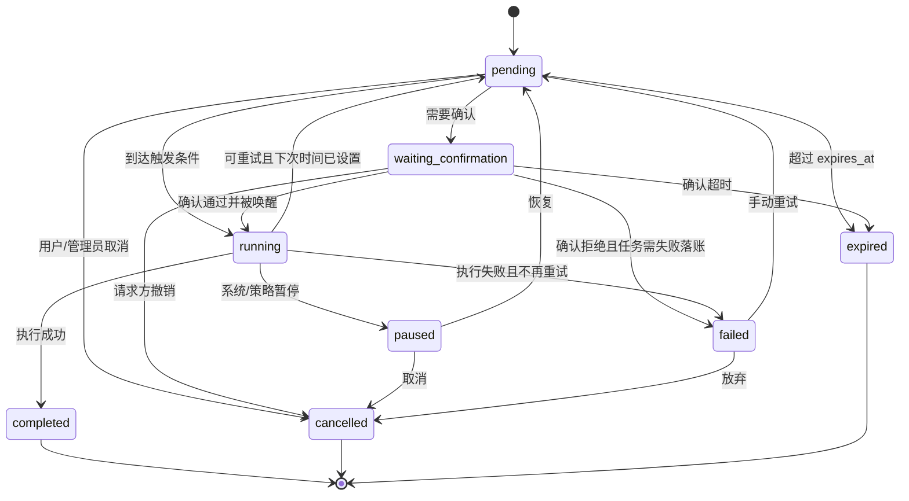
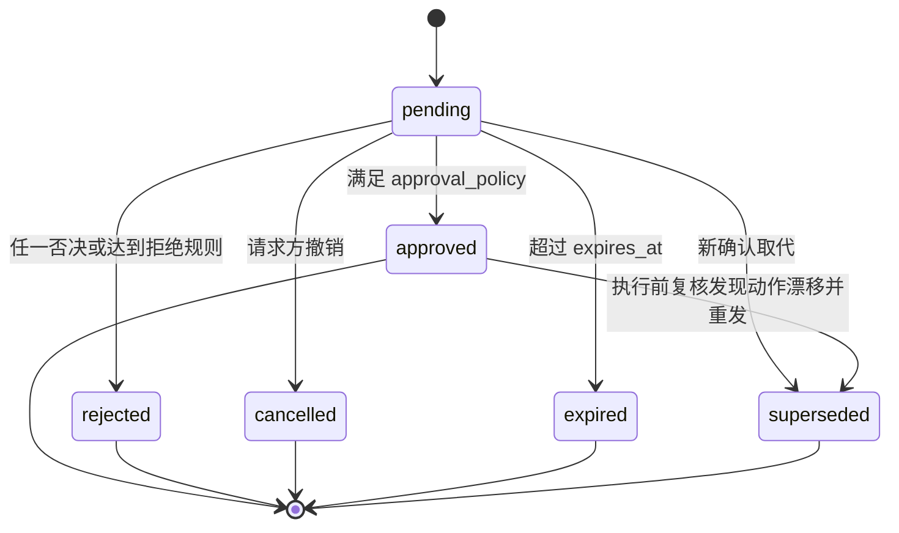

# 任务与确认设计

本文聚焦 `Task Orchestrator`、`TaskRun`、`ActionPlan` 和 `Confirmation Broker` 的第一期设计。目标是把提醒、确认、简单事件和需要跨时间处理的事情，统一建模为可持久化、可恢复、可取消、可过期、可审计的任务；其中确认也是任务的一种。

## 设计边界

- `Codex Runner` 负责理解意图、生成解释、提出 `ActionPlan`、任务建议和确认请求。
- `Task Orchestrator` 负责任务保存、调度、恢复、取消、超时和执行记录，不替代 Codex 做复杂判断。
- `Confirmation Broker` 负责创建确认、投递确认、收集决策、处理过期/撤销/拒绝/替代，不执行真实动作。
- `Tool Safety Proxy` 是所有真实世界副作用的唯一出口。任务触发和确认通过后，都必须重新进入代理做权限、状态、风险和幂等检查。
- `Audit Log` 记录任务、确认、工具调用和通知的完整链路；状态更新不能只靠覆盖当前行。

## 核心职责与链路

### Task Orchestrator

`Task Orchestrator` 是任务生命周期的事实源。它只接受结构化任务请求，不接受任意自然语言指令直接落库。

职责：

- 创建 `Task`，写入来源 trace、触发方式、去重键、过期时间和初始状态。
- 维护 `Task` 状态机，处理取消、过期、重试、暂停、恢复和终态落账。
- 为每次执行创建 `TaskRun`，把一次 attempt 的开始、结果、错误和幂等键独立记录。
- 调度 worker handler，但 handler 需要副作用时只能调用 `Tool Safety Proxy`。
- 在服务重启后根据持久化状态恢复未完成任务，而不是依赖内存队列。

非职责：

- 不替 Codex 解释复杂语义。
- 不直接决定高风险动作是否可执行。
- 不绕过 `Confirmation Broker` 收集人工确认。
- 不直接调用 HA 写接口。

### Confirmation Broker

`Confirmation Broker` 是确认请求的事实源，负责把“需要人类批准”变成可投递、可决策、可过期、可审计的流程。

职责：

- 根据策略层给出的 `approval_policy`、`eligible_approvers` 和 `required_approvers` 创建 `ConfirmationRequest`。
- 绑定用户看到的摘要、风险、状态差异、有效期和 `action_plan_hash`。
- 选择投递渠道，但最终输出对象仍由 `Notification Policy` 约束。
- 收集批准、拒绝、撤销、过期和 supersede 决策，写入 `decision_records`。
- 在确认满足策略后唤醒关联任务，而不是直接执行动作。

非职责：

- 不自行扩大确认人范围。
- 不把 Codex 生成的确认人名单当作最终授权。
- 不用确认按钮直接触发 HA 调用。

### 端到端链路

1. 入口 adapter 写入事件和 trace。
2. `Application Orchestrator` 解析身份、权限和上下文后调用 `Codex Runner`。
3. `Codex Runner` 返回解释、`ActionPlan`、任务建议或确认建议。
4. 低风险即时动作进入 `Tool Safety Proxy`；需要跨时间处理的内容创建 `Task`。
5. 需要确认的动作由 `Confirmation Broker` 创建 `ConfirmationRequest`，并由 `Task Orchestrator` 保存为 `task_type=confirmation` 的任务。
6. 确认通过后，原任务或动作任务被唤醒，重新进入 `Tool Safety Proxy` 做确认后复核。
7. 执行结果、通知、工具调用和状态变更都写入 `Audit Log`。

## 模型

### Task

`Task` 表示一个跨消息、跨时间或跨平台的持久任务。

```python
Task = {
    "task_id": "string",
    "home_id": "string",
    "created_by": "person_id|null",
    "task_type": "reminder|confirmation|monitor|scheduled_job|session_maintenance|automation_proposal",
    "status": "pending|waiting_confirmation|running|paused|completed|failed|cancelled|expired",
    "schema_version": 1,
    "dedupe_key": "string|null",
    "priority": "low|normal|high",
    "source_trace_id": "string",
    "payload": {},
    "trigger": {},
    "next_run_at": "datetime|null",
    "expires_at": "datetime|null",
    "locked_until": "datetime|null",
    "locked_by": "string|null",
    "retry_policy": {},
    "supersedes_task_id": "string|null",
    "cancel_reason": "string|null",
    "created_at": "datetime",
    "updated_at": "datetime"
}
```

关键约束：

- `task_type=confirmation` 时，`payload` 必须引用 `confirmation_id`，并保存当时的 `action_plan_hash`。
- `dedupe_key` 用于同一来源重复投递、服务重启恢复和平台重试去重。
- `locked_until` 与 `locked_by` 只表示 worker lease，不代表任务业务状态。
- `expires_at` 到期后，任务进入 `expired`，确认请求同步进入 `expired`。
- 原始动作任务和确认任务应通过 `payload.parent_task_id`、`payload.action_id` 或 trace 关联，确保确认任务终态能唤醒或终止原动作流程。

### TaskRun

`TaskRun` 表示任务每一次被 worker 或手动触发后的执行 attempt。它避免把“任务最终状态”和“某次执行结果”混在一起。

```python
TaskRun = {
    "run_id": "string",
    "task_id": "string",
    "attempt": 1,
    "triggered_at": "datetime",
    "started_at": "datetime|null",
    "finished_at": "datetime|null",
    "status": "running|succeeded|failed|skipped",
    "idempotency_key": "string",
    "result": {},
    "error": {}
}
```

关键约束：

- 每次 lease 成功后创建或复用一个 `TaskRun`。
- `idempotency_key` 必须能阻止 worker 崩溃后的重复副作用。
- `skipped` 用于确认已过期、任务已被撤销、前置条件失效或被更新任务取代。
- `failed` 只描述本次 attempt；是否重试由 `Task.retry_policy` 和任务状态机决定。

### ActionPlan

`ActionPlan` 是结构化动作意图，不等于授权。它可以来自 Codex、策略层或自动化草案。

```python
ActionPlan = {
    "action_id": "string",
    "action_type": "read_state|iot_control|automation_proposal|memory_write|identity_merge",
    "target": {},
    "params": {},
    "risk_level": "low|medium|high",
    "preconditions": [],
    "requires_confirmation": False,
    "idempotency_key": "string",
    "action_plan_hash": "string"
}
```

关键约束：

- `action_plan_hash` 用于确认时绑定用户看到的动作内容，防止确认 A 却执行 B。
- `preconditions` 只能作为复核输入，不能跳过实时查询。例如“门当前关闭”需要执行前再查 HA。
- 相对动作如“调暗一点”应在 `Tool Safety Proxy` 里规范化为可审计的绝对目标值。
- 高风险、管理写入、家庭共享记忆、身份合并和自动化创建默认需要确认。

### ConfirmationRequest

确认请求由 `Confirmation Broker` 管理，同时通过 `Task Orchestrator` 持久化为 `confirmation` 任务。

```python
ConfirmationRequest = {
    "confirmation_id": "string",
    "trace_id": "string",
    "requested_by": "person_id",
    "action_type": "iot_control|automation_create|identity_merge|memory_share",
    "status": "pending|approved|rejected|cancelled|expired|superseded",
    "risk_level": "low|medium|high",
    "summary": "string",
    "before_state": {},
    "after_state": {},
    "action_plan_hash": "string|null",
    "approval_policy": {},
    "eligible_approvers": [],
    "decision_records": [],
    "preconditions": [],
    "supersedes_confirmation_id": "string|null",
    "expires_at": "datetime",
    "required_approvers": []
}
```

关键约束：

- `before_state` 和 `after_state` 用于展示和审计，不作为最终执行依据。
- `decision_records` 记录每个确认人的身份、渠道、决定、时间和来源 trace。
- `eligible_approvers` 与 `required_approvers` 必须由策略层生成，不能由 Codex 自行指定最终名单。
- `superseded` 用于动作计划变化、状态漂移后重新发起确认、或用户修改自动化草案。

### 确认作为任务

确认不是通知消息的附属状态，而是一类可恢复任务：

- 创建确认时，同步创建 `Task.task_type=confirmation`，并将 `Task.status` 置为 `waiting_confirmation` 或让原动作任务进入 `waiting_confirmation`。
- 确认任务的 `expires_at` 与 `ConfirmationRequest.expires_at` 必须一致，任何一边过期都要条件更新另一边。
- 确认任务不执行真实副作用；它只等待 Broker 决策、过期扫描或撤销事件。
- `approved` 只表示人工批准条件满足；worker 下一次处理原动作任务时仍要重新查权限和状态。
- `rejected|cancelled|expired|superseded` 都必须让原动作任务进入明确状态，不能留下悬挂的 `waiting_confirmation`。
- 如果用户修改动作参数，应创建新的 `ConfirmationRequest` 和新的确认任务，旧确认进入 `superseded`。

## 状态机

### Task 状态机



落库规则：

- 任何状态变更都写 `AuditEvent`。
- 状态变更必须使用条件更新，例如 `where task_id=? and status in (...)`，避免并发 worker 覆盖彼此结果。
- 终态为 `completed|cancelled|expired` 后，除非显式创建新任务，不再重开原任务。

### ConfirmationRequest 状态机



状态含义：

| 状态 | 含义 | 后续动作 |
| --- | --- | --- |
| `pending` | 等待单人、多人或管理员决策 | 保持对应 `Task` 为 `waiting_confirmation` |
| `approved` | 确认策略已满足 | 唤醒任务，但不直接执行副作用 |
| `rejected` | 用户或策略明确拒绝 | 任务标记 `failed` 或 `cancelled`，通知请求方 |
| `cancelled` | 请求方撤销或管理员取消 | 任务标记 `cancelled` |
| `expired` | 超过有效期 | 任务标记 `expired`，通知可选 |
| `superseded` | 被新确认取代 | 原任务跳过或取消，新任务接管 |

## 触发方式

任务触发来源统一写入 `Task.trigger`，第一期支持以下类型：

| 触发方式 | 场景 | 处理方式 |
| --- | --- | --- |
| `time_at` | 晚上 10 点提醒关窗 | `next_run_at` 到期后 worker 执行 |
| `manual` | 用户确认、管理员手动重试 | Broker 或 API 唤醒任务 |
| `lazy_before_interaction` | 48 小时未交互后的会话压缩 | 下一次用户消息进入 Codex 前触发 |
| `event_match` | mock/HTTP/local API 事件触发洗衣机完成 | 第一期只支持简单事件匹配 |

暂缓但预留：

- `interval`：固定间隔任务。
- `cron`：周期表达式任务。
- 复杂 HA 事件订阅：第一期只从 local API、mock/HTTP 或 showcase fixture 事件进入。

## 执行记录与 Worker Lease

后台 worker 每隔几秒扫描可运行任务：

1. 查找 `next_run_at <= now` 且状态为 `pending|running` 可重试的任务。
2. 使用条件更新抢占 lease：设置 `locked_by` 和 `locked_until`。
3. 抢占成功后创建 `TaskRun`，写入 `running`。
4. 按任务类型调用对应 handler。
5. handler 只做编排；需要副作用时进入 `Tool Safety Proxy`。
6. 完成后写 `TaskRun.result` 或 `TaskRun.error`，再更新 `Task.status`、`next_run_at` 和 lease 字段。

Lease 规则：

- `locked_until` 到期后，其他 worker 可以抢占，原 worker 写回结果必须带 `locked_by` 条件，避免迟到写覆盖新 attempt。
- 每个 handler 应定期续租长任务；第一期尽量让单次 handler 短小。
- worker 崩溃后，未完成 `TaskRun` 保留为 `running`，恢复扫描时创建下一次 attempt，并在审计中标记上次可能中断。
- 有副作用动作必须使用 `ActionPlan.idempotency_key` 或 `ToolInvocation.operation_id` 去重，不能靠 lease 保证一次性。

## 确认策略

确认策略由 `approval_policy` 表达，常见类型包括：

| 策略 | 示例 | 默认行为 |
| --- | --- | --- |
| 单人确认 | 本人创建一次性提醒 | 请求人确认即可 |
| 管理员确认 | 身份合并、权限变更 | `owner` 或授权管理员确认 |
| 多人确认 | 会影响全家的自动化 | 满足 `required_approvers` 后通过 |
| 高风险二次确认 | 门锁、燃气、摄像头隐私 | 强制私聊或可信渠道确认 |
| 本人授权 | 跨用户记忆或隐私读取 | 被读取/共享的人必须确认 |

投递策略：

- 群聊发起的敏感确认默认转私聊。
- 语音发起的高风险确认默认转到已绑定手机/IM 渠道。
- 跨平台确认允许“微信发起、飞书确认”，但确认人身份必须解析为同一 `Person` 或合格管理员。
- 通知文案必须展示动作摘要、风险、有效期、目标对象和关键差异。

拒绝、撤销和过期：

- `rejected`：确认人明确拒绝。写 `decision_records`，通知请求方，不执行动作。
- `cancelled`：请求方撤销或管理员取消。任务进入 `cancelled`，保留撤销原因。
- `expired`：超过 `expires_at`。任务进入 `expired`，后续确认按钮应返回“已过期”。
- `superseded`：动作计划或家庭状态变化导致旧确认失效。旧确认不可继续批准，必须展示新的确认。

## 确认后复核

确认通过只是解除“需要人类批准”的条件，不是执行许可。任务被唤醒后必须重新进入 `Tool Safety Proxy`，完成以下复核：

1. 身份复核：确认提交者仍是合格 `eligible_approver`，账号未撤销、未暂停。
2. 权限复核：请求人和确认人当前仍有执行或授权权限。
3. 动作复核：`action_plan_hash` 与待执行 `ActionPlan` 一致。
4. 状态复核：实时查询 HA、记忆、身份或自动化目标，检查 `preconditions`。
5. 风险复核：设备风险、来源渠道、群聊/语音置信度、家庭模式没有升高风险。
6. 幂等复核：相同 `idempotency_key` 或 `operation_id` 未被执行过。

状态漂移处理：

| 漂移类型 | 示例 | 处理 |
| --- | --- | --- |
| 目标状态已变化 | 门锁已被手动打开 | 标记本次 `TaskRun=skipped`，通知无需执行 |
| 动作参数变化 | “调到 24 度”变成“调到 20 度” | 原确认 `superseded`，重新发确认 |
| 权限变化 | 用户被撤销门锁权限 | 拒绝执行，任务失败并审计 |
| 设备不可用 | HA 返回离线或 unknown | 不执行，按重试策略或失败通知 |
| 风险升级 | 低风险灯光变成批量场景 | 重新走确认 |
| 确认过期 | 用户点了旧按钮 | 返回过期提示，不执行 |

## 第一期范围

第一期实现：

- SQLite 表保存 `Task`、`TaskRun`、`ConfirmationRequest`、`ToolInvocation` 和 `AuditEvent`。
- 单进程 worker 轮询任务表，使用 `locked_until`、`locked_by` 做 lease。
- 支持一次性提醒、简单事件提醒、确认任务、可选 48 小时 session maintenance。
- 支持确认创建、本地 PWA 投递、批准、拒绝、撤销、过期。
- 支持 `ActionPlan` 哈希、确认任务绑定、确认后重新进入 `Tool Safety Proxy`。
- 高风险动作可以生成确认或 dry-run，但第一期不真实执行高风险设备写控制。
- 所有任务状态、确认决策、worker attempt、工具代理结果写审计。

建议先实现的 handler：

- `reminder`：到时间后调用 `Notification Policy` 发送提醒。
- `confirmation`：等待 Broker 决策；通过后唤醒原动作执行流程，并重新进入 `Tool Safety Proxy`。如果目标仍是第一期禁止的高风险真实写操作，最终状态为 `blocked`、`dry_run` 或 `not_supported_in_phase_1`。
- `session_maintenance`：用户 48 小时未交互后压缩会话摘要，可在第一期作为可选后台任务或 showcase 样例。
- `automation_proposal`：保存草案，确认后创建可审计的自动化记录或 demo 输出。

## 测试场景

基础任务：

- 创建晚上 10 点提醒，worker 到期执行一次，重复扫描不重复通知。
- worker 抢到 lease 后崩溃，`locked_until` 到期后另一个 worker 能恢复执行。
- 同一 `dedupe_key` 的平台重复消息不会创建两个任务。
- `TaskRun` 失败后按 `retry_policy` 进入下一次 attempt。

确认流程：

- 高风险门锁动作生成 `ConfirmationRequest` 和 `task_type=confirmation` 的任务，不直接调用 HA。
- 用户批准后，任务被唤醒，并重新进入 `Tool Safety Proxy`；第一期高风险真实写操作仍不会执行。
- 用户拒绝后，确认进入 `rejected`，任务进入失败或取消，不执行动作。
- 请求方撤销后，旧确认按钮不可再批准。
- 确认过期后点击批准，返回过期，不执行动作。
- 微信发起、飞书确认时，确认人必须解析为同一 `Person`。

状态漂移：

- 确认门锁打开前，门已被手动打开，本次执行 `skipped` 并通知无需操作。
- 确认时展示的 `action_plan_hash` 与当前待执行计划不一致，原确认 `superseded` 并重新发起。
- 确认后用户权限被撤销，执行前复核拒绝。
- HA 设备离线时不执行，并根据重试策略或失败通知处理。

安全与审计：

- 群聊里陌生人诱导确认高风险动作，应被拒绝或转私聊给合格确认人。
- ASR 低置信度语音触发门锁动作，应创建澄清/确认，不直接执行。
- 每条 trace 能串起输入、任务、确认、TaskRun、ToolInvocation、通知和审计事件。
- 服务重启后未完成确认仍可查询、过期和继续决策。

## 不做事项

第一期不做：

- 不做复杂 cron UI 和完整自动化编排界面。
- 不做完整 HA 事件订阅系统，只支持 local API、mock/HTTP 或 showcase fixture 事件触发。
- 不做独立 `Capability Registry` 或完整 `Home State` 快照。
- 不做高风险设备确认后的真实直控；先验证确认、复核和审计闭环。
- 不让 Codex 直接创建、更新或删除任务表和确认表。
- 不让确认按钮绕过 `Tool Safety Proxy` 直接调用 HA。
- 不把 `before_state`、`after_state` 当作最终事实源。
- 不使用内存队列作为唯一任务来源；重启后必须能从数据库恢复。
